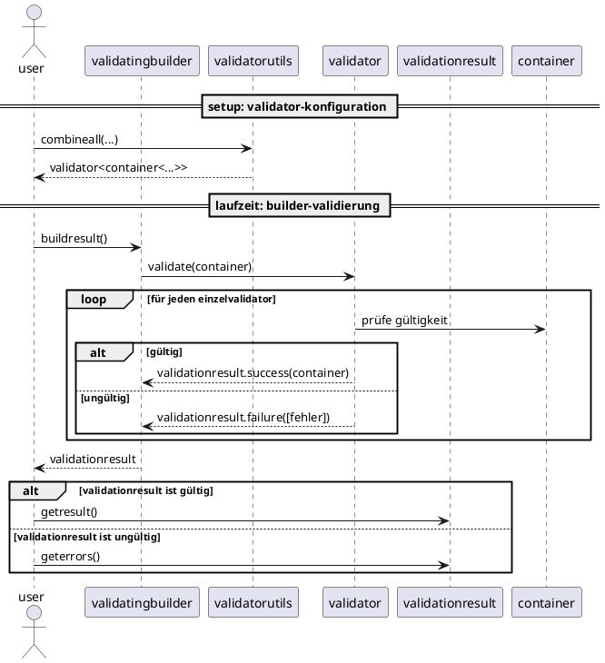

# Finale Version eines Validators

## Frage

Wie sieht eigenlich die Klasse Validator<T> nach der langen Diskussion bei dir
aus? Was kommt bei der Methode validate zurueck: Optional oder
ValidationResult? Wie sehen die anderen Methoden aus?

## Antwort

Super Frage — und jetzt ist genau der richtige Zeitpunkt für eine saubere
Konsolidierung!

### Ziel

Eine klare, funktionale, **monadisch** nutzbare `Validator<T>`-Schnittstelle, die:
- keine Validierung „nachträglich“ im Ergebnis erlaubt,
- sauber kombinierbar ist (and, or, not),
- aussagekräftige **Fehler liefert** (List<String>),
- **einheitlich mit** `ValidationResult<T>` arbeitet,
- sauber mit Lambdas oder Hilfsfunktionen nutzbar ist.

### Finales Design von `Validator<T>`

```java
import java.util.List;
import java.util.function.Predicate;
import java.util.function.Function;

@FunctionalInterface
public interface Validator<T> {
    
    ValidationResult<T> validate(T t);

    // Basis-Factory: Predicate mit Fehlermeldung
    static <T> Validator<T> of(Predicate<T> predicate, String errorMessage) {
        return t -> predicate.test(t)
            ? ValidationResult.success(t)
            : ValidationResult.failure(List.of(errorMessage));
    }

    // Optional: Validator aus Funktion mit Zugriff auf T und Resultat
    static <T> Validator<T> from(Function<T, ValidationResult<T>> func) {
        return func::apply;
    }

    // AND-Verknüpfung: beende bei Fehler oder führe beide aus
    default Validator<T> and(Validator<T> other) {
        return t -> {
            ValidationResult<T> r1 = this.validate(t);
            if (!r1.isValid()) return r1;
            return other.validate(t);
        };
    }

    // ODER-Verknüpfung: mindestens einer muss erfolgreich sein
    default Validator<T> or(Validator<T> other) {
        return t -> {
            ValidationResult<T> r1 = this.validate(t);
            if (r1.isValid()) return r1;
            ValidationResult<T> r2 = other.validate(t);
            return r2.isValid() ? r2 : ValidationResult.failure(merge(r1, r2));
        };
    }

    // NICHT-Validator: negiere das Ergebnis (z. B. für blacklists etc.)
    default Validator<T> not(String errorMessage) {
        return t -> {
            ValidationResult<T> r = this.validate(t);
            return r.isValid()
                ? ValidationResult.failure(List.of(errorMessage))
                : ValidationResult.success(t);
        };
    }

    // Kombiniert Fehler aus mehreren Ergebnissen
    private static <T> List<String> merge(ValidationResult<T> r1, ValidationResult<T> r2) {
        return new java.util.ArrayList<>() {{
            addAll(r1.getErrors());
            addAll(r2.getErrors());
        }};
    }
}
```

### Beispiel: Anwendung

```java
Validator<String> notEmpty = Validator.of(s -> s != null && !s.isBlank(), "Darf nicht leer sein");
Validator<String> minLength = Validator.of(s -> s.length() >= 5, "Mindestens 5 Zeichen");

Validator<String> combined = notEmpty.and(minLength);

ValidationResult<String> r1 = combined.validate("Hallo"); // ✅
ValidationResult<String> r2 = combined.validate("   ");   // ❌ leer
ValidationResult<String> r3 = combined.validate("Hi");    // ❌ zu kurz

System.out.println(r1); // Valid: Hallo
System.out.println(r2); // Invalid: [Darf nicht leer sein]
System.out.println(r3); // Invalid: [Mindestens 5 Zeichen]
```

### Vorteile des finalen Designs

| Feature                               | Erfüllt? |
| ------------------------------------- | -------- |
| Fehlerakkumulation                    | ✅       |
| Kombinierbarkeit (`and`, `or`, `not`) | ✅       |
| Lambda-tauglich                       | ✅       |
| Monadenfreundlich                     | ✅       |
| Typisch Java (ohne externe Libs)      | ✅       |

## Frage

Wenn du möchtest, kann ich auch eine ValidatorUtils-Klasse darauf aufbauen,
z. B. für Attribut-Validierungen wie du sie verwendet hast
(allAttributesHaveField(...), etc.). Sag einfach Bescheid!

## Antwort

ok dann jetzt die Klassen ValidatingBuilder und ValidatorUtils bitte. Danke
dir.

Sehr gerne! 👇 Hier kommen jetzt die finalisierten Klassen ValidatingBuilder<T>
und ValidatorUtils, passend zu deiner Validator<T>-Definition und dem
ValidationResult<T>-Modell.

### `ValidatingBuilder<T>`

Ein Builder, der nicht nur ein Objekt baut, sondern es auch validiert, bevor er es zurückgibt:

```java
import java.util.ArrayList;
import java.util.List;
import java.util.function.BiConsumer;
import java.util.function.Supplier;

public class ValidatingBuilder<T> {

    private final T instance;
    private final List<Validator<T>> validators = new ArrayList<>();

    public ValidatingBuilder(Supplier<T> supplier) {
        this.instance = supplier.get();
    }

    public <U> ValidatingBuilder<T> with(BiConsumer<T, U> setter, U value) {
        setter.accept(instance, value);
        return this;
    }

    public ValidatingBuilder<T> withValidator(Validator<T> validator) {
        validators.add(validator);
        return this;
    }

    public ValidationResult<T> buildResult() {
        ValidationResult<T> result = ValidationResult.success(instance);
        for (Validator<T> validator : validators) {
            result = result.flatMap(validator::validate);
            if (!result.isValid()) break; // Optional: abbrechen bei Fehler
        }
        return result;
    }
}
```

### `ValidationResult<T>`

```java
import java.util.Collections;
import java.util.List;
import java.util.Objects;
import java.util.function.Function;
import java.util.stream.Collectors;

public class ValidationResult<T> {

    private final T result;
    private final List<String> errors;

    private ValidationResult(T result, List<String> errors) {
        this.result = result;
        this.errors = errors;
    }

    public static <T> ValidationResult<T> success(T result) {
        return new ValidationResult<>(result, Collections.emptyList());
    }

    public static <T> ValidationResult<T> failure(List<String> errors) {
        return new ValidationResult<>(null, errors);
    }

    public static <T> ValidationResult<T> failure(String error) {
        return new ValidationResult<>(null, List.of(error));
    }

    public boolean isValid() {
        return errors.isEmpty();
    }

    public T getResult() {
        if (!isValid()) {
            throw new IllegalStateException("Cannot get result from invalid ValidationResult");
        }
        return result;
    }

    public List<String> getErrors() {
        return Collections.unmodifiableList(errors);
    }

    public <U> ValidationResult<U> map(Function<? super T, ? extends U> mapper) {
        if (isValid()) {
            return ValidationResult.success(mapper.apply(result));
        } else {
            return ValidationResult.failure(errors);
        }
    }

    public <U> ValidationResult<U> flatMap(Function<? super T, ValidationResult<U>> mapper) {
        if (isValid()) {
            return mapper.apply(result);
        } else {
            return ValidationResult.failure(errors);
        }
    }

    public ValidationResult<T> merge(ValidationResult<T> other) {
        if (this.isValid() && other.isValid()) {
            return this;
        }

        List<String> combinedErrors = StreamUtils.concat(this.errors, other.errors);
        return ValidationResult.failure(combinedErrors);
    }

    @Override
    public String toString() {
        return isValid() ? "Valid: " + result : "Invalid: " + errors;
    }

    @Override
    public boolean equals(Object o) {
        if (!(o instanceof ValidationResult<?> other)) return false;
        return Objects.equals(result, other.result) && Objects.equals(errors, other.errors);
    }

    @Override
    public int hashCode() {
        return Objects.hash(result, errors);
    }
}
```

### `ValidatorUtils`

Hilfsklasse für gängige Validierungsregeln, z. B. auf Container und Attribute:

```java
import java.util.List;
import java.util.Objects;
import java.util.function.Function;
import java.util.stream.Collectors;

public class ValidatorUtils {

    public static <D, A> Validator<Container<D, A>> attributesNotEmpty(String errorMessage) {
        return Validator.of(
            c -> c.getAttributes() != null && !c.getAttributes().isEmpty(),
            errorMessage
        );
    }

    public static <D, A, F> Validator<Container<D, A>> allAttributesHaveField(
            Function<A, F> fieldGetter,
            String fieldName
    ) {
        return container -> {
            List<String> errors = container.getAttributes().stream()
                .filter(attr -> fieldGetter.apply(attr) == null)
                .map(attr -> fieldName + " darf nicht null sein")
                .collect(Collectors.toList());

            return errors.isEmpty()
                ? ValidationResult.success(container)
                : ValidationResult.failure(errors);
        };
    }

    public static <D, A, F1, F2> Validator<Container<D, A>> attributeFieldDependency(
            Function<A, F1> field1,
            Function<A, F2> field2,
            String name1,
            String name2
    ) {
        return container -> {
            List<String> errors = container.getAttributes().stream()
                .filter(attr -> field1.apply(attr) != null && field2.apply(attr) == null)
                .map(attr -> "Wenn " + name1 + " gesetzt ist, muss auch " + name2 + " gesetzt sein")
                .collect(Collectors.toList());

            return errors.isEmpty()
                ? ValidationResult.success(container)
                : ValidationResult.failure(errors);
        };
    }

    public static <D, A, F1, F2> Validator<Container<D, A>> ifFieldEqualsThenOtherMustEqual(
            Function<A, F1> condField,
            F1 condValue,
            Function<A, F2> targetField,
            F2 requiredValue,
            String condName,
            String targetName
    ) {
        return container -> {
            List<String> errors = container.getAttributes().stream()
                .filter(attr -> Objects.equals(condField.apply(attr), condValue)
                             && !Objects.equals(targetField.apply(attr), requiredValue))
                .map(attr -> "Wenn " + condName + " == " + condValue +
                             ", muss " + targetName + " == " + requiredValue + " sein")
                .collect(Collectors.toList());

            return errors.isEmpty()
                ? ValidationResult.success(container)
                : ValidationResult.failure(errors);
        };
    }

    public static <T> Validator<T> combineAll(Validator<T>... validators) {
        return t -> {
            ValidationResult<T> result = ValidationResult.success(t);
            for (Validator<T> v : validators) {
                result = result.flatMap(v::validate);
            }
            return result;
        };
    }
}
```

### Beispielnutzung

```java
Validator<Container<Document, DocumentAttribute>> validator = ValidatorUtils.combineAll(
    ValidatorUtils.attributesNotEmpty("Mindestens ein Attribut muss vorhanden sein"),
    ValidatorUtils.allAttributesHaveField(DocumentAttribute::getPvaID, "pvaID"),
    ValidatorUtils.attributeFieldDependency(
        DocumentAttribute::getKey, DocumentAttribute::getValue, "key", "value"
    ),
    ValidatorUtils.ifFieldEqualsThenOtherMustEqual(
        DocumentAttribute::getKey, "status",
        DocumentAttribute::getValue, "ACTIVE",
        "key", "value"
    )
);

ValidatingBuilder<Container<Document, DocumentAttribute>> builder = new ValidatingBuilder<>(Container::new)
    .with(Container::setDocument, new Document(...))
    .with(Container::setAttributes, List.of(...))
    .withValidator(validator);

ValidationResult<Container<Document, DocumentAttribute>> result = builder.buildResult();
```

### Sequenz-Diagramm

```meirmaid
sequenceDiagram
    participant User
    participant ValidatingBuilder
    participant ValidatorUtils
    participant Validator
    participant ValidationResult

    %% Setup: Validatoren werden einmalig kombiniert
    User->>ValidatorUtils: combineAll(...)
    ValidatorUtils-->>User: Validator<Container<...>>

    %% Builder-Konfiguration und Ausführung
    User->>ValidatingBuilder: buildResult()
    ValidatingBuilder->>Validator: validate(container)

    %% Jeder Validator prüft für sich
    loop für jeden Einzelvalidator
        Validator->>container: Prüfe Gültigkeit
        alt gültig
            Validator-->>ValidatingBuilder: ValidationResult.success(container)
        else ungültig
            Validator-->>ValidatingBuilder: ValidationResult.failure([Fehler])
        end
    end

    ValidatingBuilder-->>User: ValidationResult

    alt ValidationResult gültig
        User->>ValidationResult: getResult()
    else ungültig
        User->>ValidationResult: getErrors()
    end
```



## Frage

Angenommen ich habe bereits ein Container mit Document aund Attributen. Wie
kann ich diesen Kontainer Validieren?

## Antwort

Super Frage – wenn du bereits einen **fertigen Container** hast (z. B. geladen
aus einer Datenbank oder einem REST-Aufruf) und **nur die Validierung ausführen
möchtest**, brauchst du **nicht** den ValidatingBuilder. Stattdessen rufst du
einfach den passenden `Validator<Container<D, A>>` direkt auf.

### Beispiel: Container validieren

Angenommen du hast:Angenommen du hast:

```java
Container<Document, DocumentAttribute> container = ...; // z.B. aus DB geladen
```

Und deinen zusammengesetzten Validator wie bisher:

```java
Validator<Container<Document, DocumentAttribute>> validator = ValidatorUtils.combineAll(
    ValidatorUtils.attributesNotEmpty("Mindestens ein Attribut muss vorhanden sein"),
    ValidatorUtils.allAttributesHaveField(DocumentAttribute::getPvaID, "pvaID"),
    ValidatorUtils.attributeFieldDependency(
        DocumentAttribute::getKey, DocumentAttribute::getValue, "key", "value"
    ),
    ValidatorUtils.ifFieldEqualsThenOtherMustEqual(
        DocumentAttribute::getKey, "status",
        DocumentAttribute::getValue, "ACTIVE",
        "key", "value"
    )
);
```

Dann kannst du einfach validieren mit:

```java
ValidationResult<Container<Document, DocumentAttribute>> result = validator.validate(container);

if (result.isValid()) {
    Container<Document, DocumentAttribute> validContainer = result.getResult();
    // Weiterverarbeiten
} else {
    result.getErrors().forEach(System.out::println);
    // Fehler behandeln oder protokollieren
}
```

### Warum so?

Der Vorteil des `Validator<T>`-Interfaces mit `ValidationResult<T>` ist, dass
du es sowohl mit dem `ValidatingBuilder` **als Teil des Erstellungsprozesses**,
als auch **nachträglich** auf beliebige Objekte anwenden kannst. Das ist sehr
flexibel.
